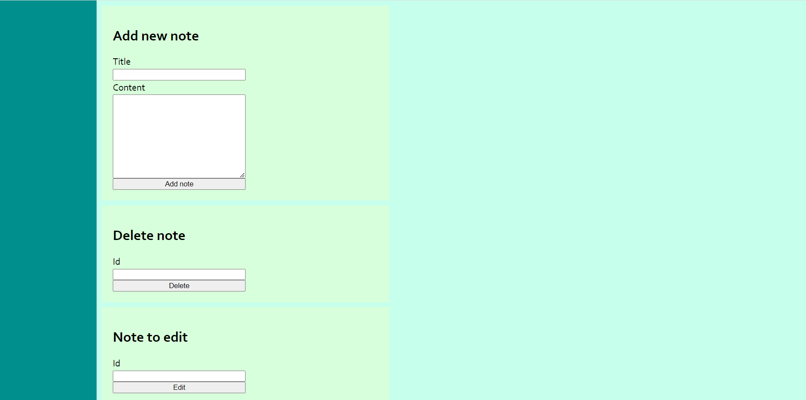
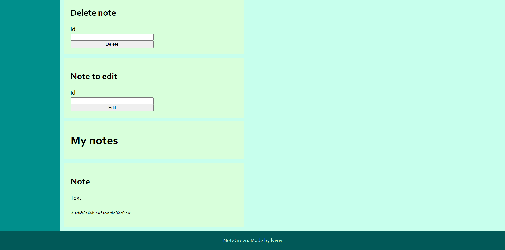

# NoteGreen
NoteGreen - клиент-серверное приложение для заметок.
### Сервер
Сервер написан на C# (ASP.NET), подключается к базе данных MSSQL.

Для работы сервера необходимо подключение к базе данных MSSQL под названием ```notes```, в которой находится таблица ```Notes``` с полями Id, Name, Content.

Запустить сервер можно, запустив ```Program.cs``` в проекте Notes.Server.

### Клиент
Клиент написан на JavaScript (без фреймворков).

Для запуска клиента нужно открыть файл index.html в браузере.

Интерфейс клиента:



